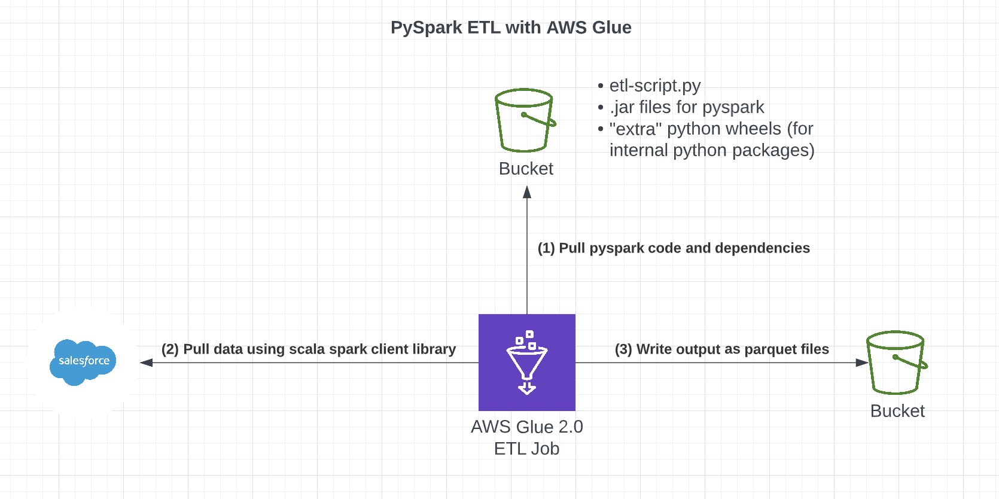

# Quicksight Dashboards

This repository is for a project that does the following:

1. Extracts data from Salesforce.com using AWS Glue (an ETL job)
2. Lands that data into S3
3. Builds a series of Athena tables via Athena Queries in AWS Step Functions
4. Exposes dashboards in AWS Quicksight with some visualizations from the data



Here are some helpful resources that this repo is patterned from:

1. [Salesforce/Pyspark tutorial](https://www.jitsejan.com/integrating-pyspark-with-salesforce) by JJ's world
2. An [AWS blogpost](https://aws.amazon.com/blogs/big-data/develop-and-test-aws-glue-version-3-0-jobs-locally-using-a-docker-container/) for developing Glue Jobs locally (because running Notebooks in the console gets expensive quickly and... local unit tests are good)
3. An [AWS blogpost](https://aws.amazon.com/blogs/big-data/extracting-salesforce-com-data-using-aws-glue-and-analyzing-with-amazon-athena/) about extracting Salesforce data into Athena using Glue

**Note** This repo has a `justfile` instead of a `makefile`. See the `justfile` target `glue-start-jupyter`
to understand how to set up the local glue environment and run `docker-compose`.

## Deploying this architecture

### Install `just` with:

```bash
brew install just
apt-get update && apt-get install -y just
choco install just
```

### Install the AWS CLI and AWS CDK

### Run `cdk bootstrap` on `us-east-2`

### Place salesforce credentials in `.env` at the root of this repository

```env
SF_USERNAME=username
SF_PASSWORD=password

# get this here: https://docs.idalko.com/exalate/display/ED/Salesforce%3A+How+to+generate+a+security+token
SF_SECURITY_TOKEN=security-token
```

### Configure an AWS profile with API access to Glue, S3, and IAM

### Install python dependencies

```bash
python -m venv ./venv/
source ./venv/bin/activate
just install
```

### Run Glue locally for development

```bash
just glue-start-jupyter
```

### Deploy to AWS

```bash
just deploy-glue
```

